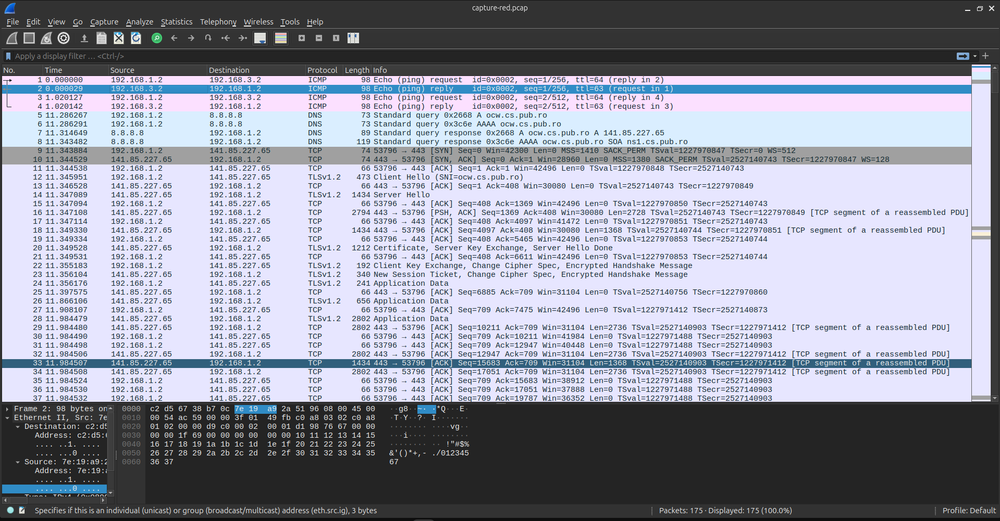

# Laborator 07


*Cuprins*:
- [Laborator 07](#laborator-07)
  - [Task 01 | Conectare SSH folosind cheie publica](#task-01--conectare-ssh-folosind-cheie-publica)
  - [Task 02 | Generare cheie publica si autentificare](#task-02--generare-cheie-publica-si-autentificare)
  - [Task 03 | Download si upload de director folosind `scp`](#task-03--download-si-upload-de-director-folosind-scp)
    - [Task 03 | Download prin `scp` (from remote to local)](#task-03--download-prin-scp-from-remote-to-local)
    - [Task 03 | Upload prin `scp` (from local to remote)](#task-03--upload-prin-scp-from-local-to-remote)
  - [Task 04 | Copiere fisiere cu diverse protocoale: durata si consum de resurse](#task-04--copiere-fisiere-cu-diverse-protocoale-durata-si-consum-de-resurse)
    - [Task 04 | Transfer prin `netcat` (a.k.a `nc`)](#task-04--transfer-prin-netcat-aka-nc)
    - [Task 04 | Transfer prin FTP](#task-04--transfer-prin-ftp)
    - [Task 04 | Transfer prin SSH](#task-04--transfer-prin-ssh)
  - [Task 05 | Trafic criptat si necriptat](#task-05--trafic-criptat-si-necriptat)
  - [Task 06 | Blocare servicii necriptate](#task-06--blocare-servicii-necriptate)
  - [Task 07 | Blocare SSH](#task-07--blocare-ssh)
  - [Task 08 | Permitere trafic SSH](#task-08--permitere-trafic-ssh)
  - [Task 09 | Stergere regului adaugate](#task-09--stergere-regului-adaugate)
  - [Task 10 | Captura de trafic](#task-10--captura-de-trafic)
  - [Task 11 (Bonus) | Blocare acces `green` -\> `red`](#task-11-bonus--blocare-acces-green---red)
  - [Task 12 (Bonus) | Transfer sincronizat de fisiere folosind `rsync` peste `SSH`](#task-12-bonus--transfer-sincronizat-de-fisiere-folosind-rsync-peste-ssh)


```sh
student@host:~# update_lab --force
student@host:~# start_lab lab-iptables
```


## Task 01 | Conectare SSH folosind cheie publica


> Tot ce a trebuit sa fac a fost sa rulez comenzile (copy paste direct).

```sh
student@red:~$ ssh student@host
student@red:~$ ssh -l student host   # La fel ca mai sus
student@red:~$ cat ~/.ssh/id_rsa.pub
student@red:~$ ssh -l student host "cat ~/.ssh/authorized_keys"
```


## Task 02 | Generare cheie publica si autentificare


```sh
corina@blue:~$ # Va genera automat, fara sa mai puna intrebari (in stdin)
corina@blue:~$ ssh-keygen -t rsa -f ~/.ssh/id_rsa -N ""
```
```
Generating public/private rsa key pair.
Created directory '/home/corina/.ssh'.
Your identification has been saved in /home/corina/.ssh/id_rsa
Your public key has been saved in /home/corina/.ssh/id_rsa.pub
The key fingerprint is:
SHA256:Q5NgDifhHuRowGD9+Lgm8l/ZqeLfne3BLB+5BeZd84A corina@blue
The key's randomart image is:
+---[RSA 3072]----+
|=.. =.+          |
|.o * * . .       |
|  o * . +        |
| . o o . .   .   |
|    +   S   E ...|
|   . . o o = + oo|
|    . o o . B o .|
|.. o.. o . = =   |
|..+oooo . o.=    |
+----[SHA256]-----+
```
```sh
corina@blue:~$ cat ~/.ssh/id_rsa.pub   # O copiez in student@host:~/.ssh/authorized_keys
```
```
ssh-rsa AAAAB3NzaC1yc2EAAAADAQABAAABgQC/WCRqCRamkGgX+cYds/LtxkapEFHGUYKYiafed9C6wMoAIeIvACwD9+JEkPaU96inoVxWPLAgkUjtXG6QHQ8KafXCp/YnvedqBDAwZd1jfCuU4fIEOA7NXB2+xL2x2YAyA1JBm25ELEOrs+cra40R2JgSwd6/xOOLdbpIV5CsRdVJEIvum3H9FbzdXoX6oeza1GbCUxemRtvmEDTHCovfNZAuhQiff+lGaYlveMPrWvIy9qZexjsee/lIYbDKsCA9ZfgE6RInOVuOJu0w/F+TMAivzmUOyTc+2ACBtaHU2LgducM6AB+kUHbSerzf5Oz0yGSWMgfVSiJmZT0q9n/jGS9w0IvVUcgWM5oxwusmYkCY6t1HYHU0zDM/ZHTsD1fAWvnI6wkbcQVpWtGBhQTEyQ80hJedW66gJN1uPjx9b5whOjorTrXQZZqCGXPRh3sMCabQy8AA2HGCxDxfLxPVeku5HX+/YQoTRT16vPYYRJtmhVfRZIydrHrDk/Cxyp0= corina@blue
```


```sh
student@host:~$ nano -l ~/.ssh/authorized_keys
student@host:~$ grep --color=ALWAYS 'corina@blue' ~/.ssh/authorized_keys 
```
```
ssh-rsa AAAAB3NzaC1yc2EAAAADAQABAAABgQC/WCRqCRamkGgX+cYds/LtxkapEFHGUYKYiafed9C6wMoAIeIvACwD9+JEkPaU96inoVxWPLAgkUjtXG6QHQ8KafXCp/YnvedqBDAwZd1jfCuU4fIEOA7NXB2+xL2x2YAyA1JBm25ELEOrs+cra40R2JgSwd6/xOOLdbpIV5CsRdVJEIvum3H9FbzdXoX6oeza1GbCUxemRtvmEDTHCovfNZAuhQiff+lGaYlveMPrWvIy9qZexjsee/lIYbDKsCA9ZfgE6RInOVuOJu0w/F+TMAivzmUOyTc+2ACBtaHU2LgducM6AB+kUHbSerzf5Oz0yGSWMgfVSiJmZT0q9n/jGS9w0IvVUcgWM5oxwusmYkCY6t1HYHU0zDM/ZHTsD1fAWvnI6wkbcQVpWtGBhQTEyQ80hJedW66gJN1uPjx9b5whOjorTrXQZZqCGXPRh3sMCabQy8AA2HGCxDxfLxPVeku5HX+/YQoTRT16vPYYRJtmhVfRZIydrHrDk/Cxyp0= corina@blue
```


Verificare
```sh
corina@blue:~$ ssh student@host
```


> La prima autentificare cu `ssh`,
> ma va intreba "Are you sure you want to continue connecting".
> Raspund cu "yes", iar altadata nu va mai intreba nimic (se va conecta automat).


## Task 03 | Download si upload de director folosind `scp`


### Task 03 | Download prin `scp` (from remote to local)

**Descarc** directorul `assignment/` din directorul `home` al utilizatorului `student` de pe statia `host`.

```sh
corina@blue:~$ scp -r student@host:~/assignment student-assignment
```

```sh
corina@blue:~$ scp -r student@host:~/assignment student-assignment
linear.txt                                                             100%   10    15.7KB/s   00:00    
cubic.txt                                                              100%   24    50.2KB/s   00:00    
quadratic.txt                                                          100%   17    39.9KB/s   00:00    
corina@blue:~$ ls
blue-file-10M.dat  solution  student-ass*ignment
corina@blue:~$ cd student-assignment/
corina@blue:~/student-assignment$ ls
cubic.txt  linear.txt  quadratic.txt
corina@blue:~/student-assignment$ cat cubic.txt 
x^3 - 6x^2 + 11x -6 = 0
corina@blue:~/student-assignment$ cat linear.txt 
x - 1 = 0
corina@blue:~/student-assignment$ cat quadratic.txt 
x^2 - 3x + 2 = 0
```


### Task 03 | Upload prin `scp` (from local to remote)


**Uploadez** direcorul `solution/` in directorul `home` al utilizatorului `student` de pe `host`.


```sh
corina@blue:~$ scp -r student@host:~/assignment student-assignment
```

```sh
corina@blue:~$ scp -r student@host:~/assignment student-assignment
linear.txt                                                             100%   10    15.7KB/s   00:00    
cubic.txt                                                              100%   24    50.2KB/s   00:00    
quadratic.txt                                                          100%   17    39.9KB/s   00:00  

student@host:~$ ls
assignment  host-file-10M.dat  pwndbg  solution
student@host:~$ cd solution/
student@host:~/solution$ ls
cubic.txt  linear.txt  quadratic.txt
student@host:~/solution$ cat cubic.txt 
x1 = 1, x2 = 2, x3 = 3
student@host:~/solution$ cat linear.txt 
x = 1
student@host:~/solution$ cat quadratic.txt 
x1 = 1, x2 = 2
```


## Task 04 | Copiere fisiere cu diverse protocoale: durata si consum de resurse


### Task 04 | Transfer prin `netcat` (a.k.a `nc`)

```sh
# Terminal 1
student@host:~$ nc -l 12345 > file-100M-nc.dat
```

```sh
# Terminal 2
student@green:~$ time cat file-100M.dat | nc -q0 host 12345

real	0m0.225s
user	0m0.011s
sys	0m0.081s
```


Verific **hash**-urile:

```sh
# Terminal 1
student@host:~$ sha512sum file-100M-nc.dat 
0fd2d103367c010b4f21ab2c6d1be7adf888e186f0e19363d8e19dbbfef1b491540566894a82f2d701f108a6aff589e70286537da9641f076639626058c38614  file-100M-nc.dat
```


```sh
# Terminal 2
student@green:~$ sha512sum file-100M.dat 
0fd2d103367c010b4f21ab2c6d1be7adf888e186f0e19363d8e19dbbfef1b491540566894a82f2d701f108a6aff589e70286537da9641f076639626058c38614  file-100M.dat
```


### Task 04 | Transfer prin FTP


```sh
student@green:~$ time curl -T file-100M.dat -u student:student ftp://host/file-100M-ftp.dat

  % Total    % Received % Xferd  Average Speed   Time    Time     Time  Current
                                 Dload  Upload   Total   Spent    Left  Speed
100  100M    0     0  100  100M      0   278M --:--:-- --:--:-- --:--:--  279M

real	0m0.505s
user	0m0.004s
sys	0m0.048s
```


### Task 04 | Transfer prin SSH


```sh
student@green:~$ time scp file-100M.dat student@host:file-100M-scp.dat

file-100M.dat                                                          100%  100MB 181.5MB/s   00:00    

real	0m0.714s
user	0m0.164s
sys	0m0.083s
```


## Task 05 | Trafic criptat si necriptat


Se ruleaza comenzile cu copy-paste

```sh
# Terminal 1
root@host:~# tcpdump -vvv -A -i veth-green
```


```sh
# Terminal 2
root@red:~# telnet green    # (usernmae: student; parola: student)
root@red:~# ftp green       # Same 
root@red:~# ssh -l student green
```


## Task 06 | Blocare servicii necriptate


```sh
root@host:~# # Blocheaza 'telent green'
root@host:~# iptables -A FORWARD -d green -p tcp --dport telnet -j REJECT
root@host:~# # Blocheaza 'ftp green'
root@host:~# iptables -A FORWARD -d green -p tcp --dport ftp -j REJECT
```

> In loc de argumentul `telnet`/`ftp` pentru `--dport`,
> se poate folosi portul numeric `23`/`21`.

> Asocierile dintre protocol si port se gasesc in `/etc/services`. 


```sh
student@red:~$ ftp green
ftp: Can't connect to `192.168.2.2:21': Bad file descriptor
ftp: Can't connect to `green:ftp'
ftp> 
ftp> ls
Not connected.
ftp> ls
Not connected.
ftp> ls
Not connected.
ftp> ^D
student@red:~$ 
exit
root@host:~# iptables -L FORWARD -v -n
# Warning: iptables-legacy tables present, use iptables-legacy to see them
Chain FORWARD (policy ACCEPT 403 packets, 34224 bytes)
 pkts bytes target     prot opt in     out     source               destination         
    2   120 REJECT     tcp  --  *      *       0.0.0.0/0            192.168.2.2          tcp dpt:23 reject-with icmp-port-unreachable
    1    60 REJECT     tcp  --  *      *       0.0.0.0/0            192.168.2.2          tcp dpt:21 reject-with icmp-port-unreachable

```

## Task 07 | Blocare SSH


```sh
root@host:~# iptables -A FORWARD -d green -p tcp --dport ssh -j REJECT
root@host:~# go red
student@red:~$ ssh student@green
ssh: connect to host green port 22: Connection refused
```

```sh
# Comenzi de verificare iptables
root@host:~# iptables -L FORWARD
root@host:~# iptables -L FORWARD -vv -n
```


```
# Warning: iptables-legacy tables present, use iptables-legacy to see them
Chain FORWARD (policy ACCEPT 403 packets, 34224 bytes)
 pkts bytes target     prot opt in     out     source               destination         
    2   120 REJECT     tcp  --  *      *       0.0.0.0/0            192.168.2.2          tcp dpt:23 reject-with icmp-port-unreachable
    1    60 REJECT     tcp  --  *      *       0.0.0.0/0            192.168.2.2          tcp dpt:21 reject-with icmp-port-unreachable
    2   120 REJECT     tcp  --  *      *       0.0.0.0/0            192.168.2.2          tcp dpt:22 rejec
```


## Task 08 | Permitere trafic SSH


```sh
root@host:~# iptables -I FORWARD 3 -s red -d green -p tcp --dport ssh -j ACCEPT
```

```sh
# Comanda de verificare
root@host:~# iptables -L FORWARD -vv -n
```
```
# Warning: iptables-legacy tables present, use iptables-legacy to see them
Chain FORWARD (policy ACCEPT 403 packets, 34224 bytes)
 pkts bytes target     prot opt in     out     source               destination         
    2   120 REJECT     tcp  --  *      *       0.0.0.0/0            192.168.2.2          tcp dpt:23 reject-with icmp-port-unreachable
    1    60 REJECT     tcp  --  *      *       0.0.0.0/0            192.168.2.2          tcp dpt:21 reject-with icmp-port-unreachable
    0     0 ACCEPT     tcp  --  *      *       192.168.1.2          192.168.2.2          tcp dpt:22
    2   120 REJECT     tcp  --  *      *       0.0.0.0/0            192.168.2.2          tcp dpt:22 reject-with icmp-port-unreachable
```


```sh
# Verificare
student@red:~$ ssh student@green    # Merge
student@blue:~$ ssh student@green   # Connection refused (e bine) :)
```


## Task 09 | Stergere regului adaugate

```sh
root@host:~# iptables -F FORWARD
```

```sh
# Comanda de verificare
root@host:~# iptables -L FORWARD -n -v
```


```sh
student@red:~$ telnet green       # Merge
student@red:~$ ftp student@green  # Merge
student@red:~$ ssh student@green  # Merge

student@blue:~$ telnet green       # Merge
student@blue:~$ ftp student@green  # Merge
student@blue:~$ ssh student@green  # Merge
```


## Task 10 | Captura de trafic


```sh
# Terminalul 1
root@host:~# tcpdump -i veth-red -v -w capture-red.pcap
```

```sh
# Terminalul 2
student@red:~$ ping blue
student@red:~$ wget https://ocw.cs.pub.ro/courses/rl/labs/07
student@red:~$ ssh student@green
```


```sh
root@host:~# mv capture-red.pcap /home/student/
```

```sh
je@localhost:~$ scp -J <moodle-username>@fep.grid.pub.ro student@<IP-VM>:~/capture-red.pcap ~/Downloads/capture-red.pcap
je@localhost:~$ wireshark ~/Downloads/capture-red.pcap &
```


<br>

<br>

Pachete analizate contin:
- Protocolul ICMP pentru ping-uri
- Este si un ARP undeva pe acolo ("Who has IP....?")
- Protocolul DNS pentru wget (se face domain resolution)
- TLSv1.2 pentru descarcaea paginii web
- SSHv2
 


## Task 11 (Bonus) | Blocare acces `green` -> `red`


```sh
# Blocheaza traficul TCP initiat de la green la red (green -> red)
root@host:~# iptables -A FORWARD -s green -d red -p tcp -m state --state NEW -j REJECT
```


```sh
# Comanda de verificare
root@host:~# iptables -L FORWARD -vv -n
```
```
# Warning: iptables-legacy tables present, use iptables-legacy to see them
Chain FORWARD (policy ACCEPT 1063 packets, 105K bytes)
 pkts bytes target     prot opt in     out     source               destination         
    2   120 REJECT     tcp  --  *      *       192.168.2.2          192.168.1.2          state NEW reject-with icmp-port-unreachable

```


## Task 12 (Bonus) | Transfer sincronizat de fisiere folosind `rsync` peste `SSH`

> **TL;DR**: `rsync -avz -r --delete -e "ssh -i /home/ana/.ssh/blue-bogdan" ~/proiecte/ bogdan@blue:~/proiecte-backup`.


```sh
student@host:~$ sudo su - ana

ana@host:~$ # Generare pereche chei SSH
ana@host:~$ ssh-keygen -t ed25519 -f ~/.ssh/blue-bogdan -N ""
```


```sh
ana@host:~$ # Nu merge... cere parola :(
ana@host:~$ ssh-copy-id -i ~/.ssh/blue-bogdan.pub bogdan@blue
bogdan@blue's password: 
```

De vreme ce `ssh-copy-id -i ~/.ssh/blue-bogdan bogdan@blue` nu functioneaza,
va trebui sa copiez manual **cheia publica** in fisierul `~/.ssh/authorized_keys`
de pe `bogdan@blue`.


```sh
ana@host:~$ cat ~/.ssh/blue-bogdan.pub 
ssh-ed25519 AAAAC3NzaC1lZDI1NTE5AAAAINp7juYp8oqg4v3W5RvvPk5gFUvFHTgkq3X3GlUBD8ot ana@host
```


Deschid un nou terminal (`Ctrl+Shift+T`) si ma autentific ca `bogdan@blue`.


```sh
student@host:~$ go blue
student@blue:~$ sudo su - bogdan
bogdan@blue:~$ 
```


```sh
bogdan@blue:~$ # Copiez cheia publica aici
bogdan@blue:~$ nano -l ~/.ssh/authorized_keys

bogdan@blue:~$ cat ~/.ssh/authorized_keys 
ssh-ed25519 AAAAC3NzaC1lZDI1NTE5AAAAINp7juYp8oqg4v3W5RvvPk5gFUvFHTgkq3X3GlUBD8ot ana@host
```


Apoi, pe `host`:

```sh
ana@host:~$ # Verificare conectare fara parola
ana@host:~$ ssh -i ~/.ssh/blue-bogdan bogdan@blue
```


```sh
ana@host:~$ # Sincronizare
ana@host:~$ rsync -avz -r --delete -e "ssh -i /home/ana/.ssh/blue-bogdan" ~/proiecte/ bogdan@blue:~/proiecte-backup
```

Verificare, dupa rularea `rsync`-ului

```sh
bogdan@blue:~$ ls --recursive
bogdan@blue:~$ # Sau
bogdan@blue:~$ tree
```


Alternativ, se poate crea o intrare in fisierul de configuratie SSH
pentru autentificarea fara parola pe `bogdan@blue`.


```sh
ana@host:~$ nano -l ~/.ssh/config
```

```
Host blue
	HostName blue
	IdentityFile ~/.ssh/blue-bogdan
```


```sh
ana@host:~$ # Verificare conectare fara parola
ana@host:~$ ssh bogdan@blue
```


```sh
ana@host:~$ # Sincronizare
ana@host:~$ rsync -avz -r --delete -e ssh ~/proiecte/ bogdan@blue:~/proiecte-backup
ana@host:~$ # Alternativ
ana@host:~$ rsync -avz -r --delete ~/proiecte/ bogdan@blue:~/proiecte-backup
```

> NOTA:
> Daca exista o configuratie de SSH definita in `~/.ssh/config`,
> `rsync`-ul va folosi automat intrarea respectiva.
> In acest caz, optiunea `-e ssh` nu mai este necesara.
